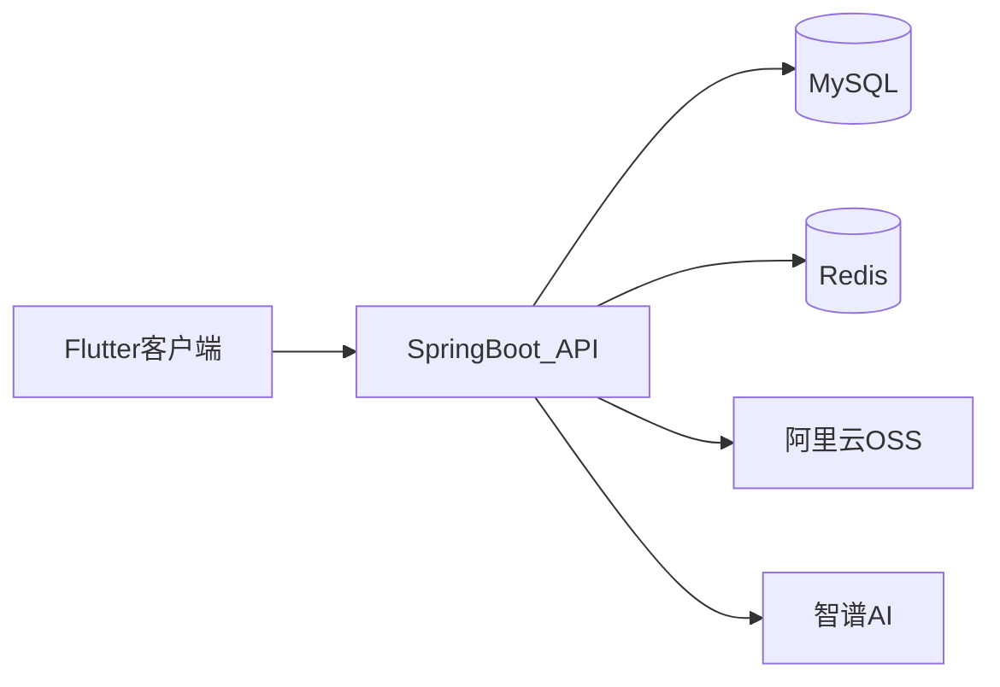

# 玺记（Xiji）家庭记账后端 - Spring Boot 开源记账 API

[](https://openjdk.org)
[](https://spring.io/projects/spring-boot)
[](https://www.mysql.com)
[](https://redis.io)
[](LICENSE)

**Xiji** backend is an open-source **family finance / bookkeeping** API for a Flutter expense tracker.

**玺记（Xiji）** 是一款开源家庭记账 / 家庭账本应用。本仓库是 Spring Boot 后端：JWT 鉴权、家庭协作、语音记账解析、微信 / 支付宝 / 京东账单导入、统计与月度预算。客户端见 Flutter 仓库。

应用界面见前端 README：[xiji_flutter](https://github.com/liberty-ask/xiji_flutter#界面预览)

## 相关仓库

GitHub 为源仓库；Gitee 为同步镜像，内容以 GitHub 为准。

| 端 | GitHub（源仓库） | Gitee（同步镜像） |
| --- | --- | --- |
| 后端（本仓库） | [liberty-ask/xiji](https://github.com/liberty-ask/xiji) | [liberty-warehouse/xiji](https://gitee.com/liberty-warehouse/xiji) |
| 前端 Flutter | [liberty-ask/xiji_flutter](https://github.com/liberty-ask/xiji_flutter) | [liberty-warehouse/xiji_flutter](https://gitee.com/liberty-warehouse/xiji_flutter) |

## API 能力

- **认证**：手机号注册 / 登录 / 忘记密码；测试环境可不发短信，验证码直接返回前端
- **家庭**：注册成功后自动创建第一个家庭；邀请码、扫码申请、审核、成员、退出、多家庭切换
- **记账**：账单增删改查；语音文本由智谱 AI 解析为分类与金额
- **账单导入**：微信 xlsx/xls、支付宝 csv、京东 csv；异步解析与导入（招行解析器入口已关闭）
- **分类、统计、日历、月度预算**
- **文件**：头像等上传至阿里云 OSS

## 架构



分层：Controller → Service → Mapper（MyBatis-Plus）→ Entity / DTO。JWT 鉴权，AOP 处理日志等横切逻辑。

## 技术栈

| 技术 | 版本 | 用途 |
| --- | --- | --- |
| Spring Boot | 3.4.4 | Web API |
| OpenJDK | 21 | 运行环境 |
| MyBatis-Plus | 3.5.7 | ORM |
| MySQL | 8.0+ | 数据存储 |
| Redis | 7.0+ | 验证码与缓存 |
| JJWT | 0.12.5 | Token |
| HikariCP | Spring Boot 默认 | 连接池 |
| 阿里云 OSS | 3.17.4 | 文件存储 |
| 阿里云短信 | dysmsapi | 生产环境验证码 |
| 智谱 AI SDK | 0.3.0 | 语音记账与导入分类 |
| Apache POI / Commons CSV | 5.2.5 / 1.10.0 | 账单文件解析 |
| SpringDoc OpenAPI | 2.3.0 | Swagger UI |

## 本地运行

### 环境

- JDK 21
- MySQL 8.0+
- Redis 7.0+
- Maven 3.8+

```bash
git clone https://github.com/liberty-ask/xiji.git
cd xiji
```

### 1. 建库并导入表结构

配置里的库名由环境变量 `DB_NAME` 指定。本地可先建库再执行脚本：

```sql
CREATE DATABASE family_financial DEFAULT CHARACTER SET utf8mb4 COLLATE utf8mb4_unicode_ci;
```

然后导入仓库根目录的 [`database_schema.sql`](database_schema.sql)。

### 2. 配置

开发用 [`src/main/resources/application-test.yml`](src/main/resources/application-test.yml)，生产用 [`application-active.yml`](src/main/resources/application-active.yml)。敏感项走环境变量，不要把密钥写进仓库。

| 变量 | 说明 |
| --- | --- |
| `DB_HOST` `DB_PORT` `DB_NAME` `DB_USERNAME` `DB_PASSWORD` | MySQL |
| `REDIS_HOST` `REDIS_PORT` `REDIS_PASSWORD` `REDIS_DATABASE` | Redis |
| `JWT_SIGN_KEY` | JWT 签名密钥 |
| `ALIYUN_OSS_ENDPOINT` `ALIYUN_OSS_ACCESS_KEY_ID` `ALIYUN_OSS_ACCESS_KEY_SECRET` `ALIYUN_OSS_BUCKET_NAME` `ALIYUN_OSS_CUSTOM_DOMAIN` `ALIYUN_OSS_FOLDER` | 对象存储 |
| `ZHIPU_AI_API_KEY` `ZHIPU_AI_MODEL` | 智谱（语音解析、导入分类） |
| `CORS_ALLOWED_ORIGINS` | 允许的前端来源 |

测试 profile 中短信默认关闭（`custom.sms.enable: false`），验证码会返回给客户端，便于本地调试。

Windows PowerShell 示例：

```powershell
$env:DB_HOST="127.0.0.1"
$env:DB_PORT="3306"
$env:DB_NAME="family_financial"
$env:DB_USERNAME="root"
$env:DB_PASSWORD="your_password"
$env:REDIS_HOST="127.0.0.1"
$env:REDIS_PORT="6379"
$env:REDIS_PASSWORD=""
$env:REDIS_DATABASE="0"
$env:JWT_SIGN_KEY="replace-with-a-long-secret"
$env:CORS_ALLOWED_ORIGINS="*"
```

OSS 与智谱密钥按你实际账号填写。未配置时，头像上传和 AI 解析相关接口会失败，记账主流程仍可联调。

### 3. 启动

服务端口 **8089**（见 [`application.yml`](src/main/resources/application.yml)）。本地请显式使用 test profile：

```bash
mvn clean package -DskipTests
java -jar target/xiji-1.0.0.jar --spring.profiles.active=test
```

或：

```bash
mvn spring-boot:run -Dspring-boot.run.profiles=test
```

### API 文档

开发环境：<http://localhost:8089/swagger-ui.html>

生产 profile 可按配置关闭 Swagger。客户端 Debug 默认请求 `http://127.0.0.1:8089/api`。

## 常见问题

- **启动失败**：检查 MySQL / Redis 是否已启动，以及上表环境变量是否齐全。
- **前端连不上**：确认后端已在 8089 监听；真机请把 Flutter 里的 `127.0.0.1` 改成电脑局域网 IP。
- **验证码收不到**：test profile 默认不发短信，看接口返回或日志中的验证码。
- **账单导入失败**：确认文件格式（微信 xlsx/xls、支付宝/京东 csv），并检查智谱 API Key 是否可用于分类。

## 许可证

[MIT License](LICENSE)。可商用、可修改、可再分发，需保留版权与许可声明。

## 贡献

请在 GitHub 源仓库参与： [liberty-ask/xiji](https://github.com/liberty-ask/xiji)

1. Fork GitHub 仓库
2. 新建分支（例如 `feat/xxx` 或 `fix/xxx`）
3. 提交变更并向 GitHub 发起 Pull Request

---

**玺记** — 温馨家庭，共同记账
