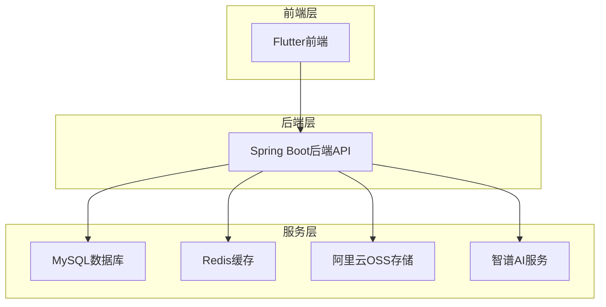

# 玺记 - 家庭财务管理系统


## 项目介绍

**玺记（Xiji）**是一款专为家庭定制的智能财务管理系统，采用**Spring Boot + Flutter**实现前后端分离架构。系统以直观的界面和强大的功能，帮助家庭精确追踪收支动态，提供智能统计分析，让家庭财务管理变得高效而简单。

> **项目特点**：本项目是**纯AI开发**的项目，全程没有人员写过任何一行代码。开发过程中使用的IDE包括**Cursor**和**Trae**，充分利用AI的能力实现了从需求分析到代码生成的全流程自动化开发。

### 相关仓库

- **前端仓库**：[xiji_flutter](https://gitee.com/duyuanyua/xiji_flutter.git)（Flutter 跨平台应用）
- **后端仓库**：[xiji](https://gitee.com/duyuanyua/xiji.git)（Spring Boot 后端服务）

### 核心优势

- **智能记账**：支持语音记账、图片识别记账，提高记账效率
- **家庭协作**：支持多成员共同管理家庭财务，实时同步数据
- **统计分析**：提供多维度财务统计报表，帮助家庭掌握财务状况
- **预算管理**：支持设置家庭预算，实时监控预算执行情况
- **数据安全**：采用JWT认证，数据加密存储，确保财务信息安全

## 系统架构

### 整体架构



### 后端架构

- **Controller层**：处理HTTP请求，参数验证，返回响应
- **Service层**：实现业务逻辑，处理核心功能
- **Mapper层**：数据库操作，使用MyBatis Plus简化CRUD
- **Entity层**：数据模型，对应数据库表结构
- **DTO层**：数据传输对象，处理请求和响应数据
- **Utils层**：工具类，提供通用功能
- **Aspect层**：AOP切面，处理日志、权限等横切关注点

### 前端架构

- **Flutter框架**：跨平台移动应用开发
- **状态管理**：Provider/Bloc
- **网络请求**：Dio
- **UI组件**：自定义组件 + Flutter内置组件
- **数据存储**：SharedPreferences + SQLite

## 技术栈

### 后端技术栈

| 技术 | 版本 | 用途 |
|------|------|------|
| Spring Boot | 3.4.4 | 应用框架 |
| MySQL | 8.0.26 | 关系型数据库 |
| MyBatis + MyBatis Plus | 3.5.7 | ORM框架 |
| Redis | 7.0+ | 缓存、会话管理 |
| JWT | 0.12.5 | 身份认证 |
| AOP | Spring AOP | 权限控制、日志记录 |
| HikariCP | 5.1.0 | 数据库连接池 |
| Alibaba Cloud OSS | 3.17.4 | 文件存储 |
| 智谱AI SDK | 0.3.0 | 智能识别、语音处理 |
| OpenJDK | 21 | Java运行环境 |

### 前端技术栈

| 技术 | 版本 | 用途 |
|------|------|------|
| Flutter | 3.0+ | 跨平台移动应用框架 |
| Dart | 3.0+ | 开发语言 |
| Provider | 6.0+ | 状态管理 |
| Dio | 5.0+ | 网络请求 |
| SharedPreferences | 2.0+ | 本地存储 |
| SQLite | - | 本地数据库 |
| Flutter Chart | 1.0+ | 图表展示 |

## 核心功能

### 1. 用户管理

- **注册登录**：支持手机号注册、验证码登录、密码登录
- **个人中心**：修改个人信息、头像、密码
- **权限管理**：基于JWT的身份认证，AOP权限控制

### 2. 家庭管理

- **创建家庭**：用户可创建多个家庭
- **邀请成员**：通过手机号邀请家庭成员
- **成员管理**：管理家庭成员，设置管理员权限
- **家庭切换**：支持在多个家庭间快速切换

### 3. 记账功能

- **手动记账**：选择分类、金额、日期、备注
- **语音记账**：通过语音识别自动生成记账记录
- **图片识别**：上传账单图片，自动识别金额、分类
- **批量导入**：支持导入微信账单、支付宝账单、京东账单等

### 4. 分类管理

- **默认分类**：系统提供常用收支分类
- **自定义分类**：支持用户创建、修改、删除分类
- **分类图标**：为分类设置个性化图标

### 5. 统计分析

- **收支概览**：月度、年度收支总览
- **分类统计**：按分类统计收支占比
- **趋势分析**：收支趋势图表展示
- **成员统计**：家庭成员收支对比

### 6. 预算管理

- **设置预算**：为家庭或个人设置月度预算
- **预算监控**：实时监控预算执行情况
- **预算提醒**：预算超支提醒

### 7. 数据安全

- **数据加密**：敏感数据加密存储
- **备份恢复**：支持数据备份和恢复
- **登录保护**：登录失败次数限制，防止暴力破解

## 安装部署

### 后端部署

#### 1. 环境准备

- **JDK 21**：安装OpenJDK 21或Oracle JDK 21
- **MySQL 8.0+**：安装MySQL 8.0或更高版本
- **Redis 7.0+**：安装Redis 7.0或更高版本
- **Maven 3.8+**：用于构建项目

#### 2. 数据库配置

1. **创建数据库**：
   ```sql
   CREATE DATABASE family_financial DEFAULT CHARACTER SET utf8mb4 COLLATE utf8mb4_unicode_ci;
   ```

2. **导入数据库脚本**：
   执行 `database_schema.sql` 文件，创建表结构

#### 3. 项目配置

1. **修改配置文件**：
   - 开发环境：`src/main/resources/application-test.yml`
   - 生产环境：`src/main/resources/application-active.yml`

2. **设置环境变量**：
   创建 `.env` 文件，配置敏感信息（详见 `.env.example`）

#### 4. 构建运行

```bash
# 构建项目
mvn clean package -DskipTests

# 运行项目（开发环境）
java -jar target/xiji-1.0.0.jar --spring.profiles.active=test

# 运行项目（生产环境）
java -jar target/xiji-1.0.0.jar --spring.profiles.active=active
```

### 前端部署

#### 1. 环境准备

- **Flutter 3.0+**：安装Flutter SDK
- **Dart 3.0+**：Flutter内置
- **Android Studio**：用于Android开发
- **Xcode**：用于iOS开发（仅Mac）

#### 2. 项目配置

1. **修改API地址**：
   修改 `lib/config/api_config.dart` 中的API地址

2. **配置其他参数**：
   根据需要修改 `lib/config/app_config.dart` 中的配置

#### 3. 构建运行

```bash
# 安装依赖
flutter pub get

# 运行项目
flutter run

# 构建Android APK
flutter build apk

# 构建iOS IPA
flutter build ios
```

## 使用说明

### 1. 首次使用

1. **注册账号**：使用手机号注册，获取验证码
2. **创建家庭**：注册成功后，创建第一个家庭
3. **设置预算**：为家庭设置月度预算
4. **开始记账**：选择记账方式，开始记录收支

### 2. 示例登录

为了方便用户快速体验系统，提供以下示例账号：
- **手机号**：13333333333
- **密码**：1234567

> **注意**：示例账号仅用于体验系统功能，请勿用于生产环境。

### 2. 日常使用

- **记账**：点击首页"+"按钮，选择记账方式
- **查看统计**：点击底部导航栏"统计"，查看财务报表
- **管理家庭**：点击底部导航栏"我的"，进入家庭管理
- **邀请成员**：在家庭管理中，点击"邀请成员"，输入手机号邀请

### 3. 高级功能

- **语音记账**：点击语音记账按钮，说出收支信息
- **图片识别**：点击图片记账按钮，拍摄或选择账单图片
- **批量导入**：在"我的"页面，点击"账单导入"，选择导入方式
- **数据备份**：在"我的"页面，点击"数据备份"，选择备份方式

## API文档

系统集成了SpringDoc OpenAPI 3，提供API文档：

- **开发环境**：`http://localhost:8089/swagger-ui.html`
- **生产环境**：默认关闭，可在配置文件中开启

## 开发指南

### 代码规范

- **Java**：遵循阿里巴巴Java开发规范
- **Dart**：遵循Flutter官方代码规范
- **Git**：使用Git Flow工作流

### 提交规范

```
<type>(<scope>): <subject>

<body>

<footer>
```

- **type**：feat（新功能）、fix（修复）、docs（文档）、style（格式）、refactor（重构）、test（测试）、chore（构建）
- **scope**：功能模块
- **subject**：提交摘要
- **body**：详细描述
- **footer**：关联issue等

### 测试

- **单元测试**：`src/test/java` 目录下
- **集成测试**：使用Postman或Swagger UI测试API

## 常见问题

### 1. 无法启动后端服务

- 检查数据库连接配置是否正确
- 检查Redis服务是否运行
- 检查环境变量是否设置

### 2. 前端无法连接后端

- 检查API地址配置是否正确
- 检查网络连接是否正常
- 检查后端服务是否启动

### 3. 记账数据不同步

- 检查网络连接是否正常
- 尝试手动同步数据
- 检查家庭成员权限是否正确

## 贡献指南

1. **Fork** 本仓库
2. **Clone** 到本地
3. **Create** 新分支（`git checkout -b feat/xxx`）
4. **Commit** 代码（`git commit -m "feat: 描述"`）
5. **Push** 到远程（`git push origin feat/xxx`）
6. **Create** Pull Request

## 许可证

本项目采用 **MIT License** 开源协议。

```
MIT License

Copyright (c) 2026 玺记团队

Permission is hereby granted, free of charge, to any person obtaining a copy
of this software and associated documentation files (the "Software"), to deal
in the Software without restriction, including without limitation the rights
to use, copy, modify, merge, publish, distribute, sublicense, and/or sell
copies of the Software, and to permit persons to whom the Software is
furnished to do so, subject to the following conditions:

The above copyright notice and this permission notice shall be included in all
copies or substantial portions of the Software.

THE SOFTWARE IS PROVIDED "AS IS", WITHOUT WARRANTY OF ANY KIND, EXPRESS OR
IMPLIED, INCLUDING BUT NOT LIMITED TO THE WARRANTIES OF MERCHANTABILITY,
FITNESS FOR A PARTICULAR PURPOSE AND NONINFRINGEMENT. IN NO EVENT SHALL THE
AUTHORS OR COPYRIGHT HOLDERS BE LIABLE FOR ANY CLAIM, DAMAGES OR OTHER
LIABILITY, WHETHER IN AN ACTION OF CONTRACT, TORT OR OTHERWISE, ARISING FROM,
OUT OF OR IN CONNECTION WITH THE SOFTWARE OR THE USE OR OTHER DEALINGS IN THE
SOFTWARE.
```

## 联系方式

- **作者**：liberty
- **QQ**：1014434012
- **邮箱**：1014434012@qq.com

## 鸣谢

- **Spring Boot**：提供强大的后端框架
- **Flutter**：提供跨平台移动开发能力
- **MyBatis Plus**：简化数据库操作
- **智谱AI**：提供智能识别能力
- **阿里云**：提供OSS存储服务

---

**玺记** - 让家庭财务管理更简单
